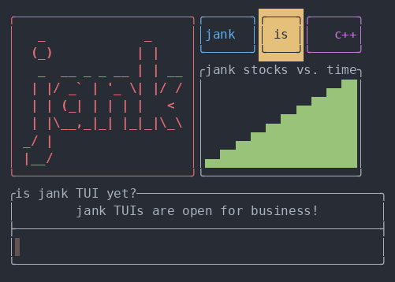

# minitui

[](https://clojars.org/io.github.kylc/minitui)

Create terminal user interfaces in jank.



## Requirements

- cmake
- a C++ compiler

## Installation

Add the following dependency to your Leiningen project file:

``` clojure
[io.github.kylc/minitui "0.2.0"]
```

## Usage

See the [examples](./examples/).

``` clojure
(ns tiny
  (:require [minitui.dom :as d]
            [minitui.screen :as s]))

(let [screen (s/create (s/fixed 50) (s/fixed 5))]
  (->>
   (d/center
    (d/border
     (d/vbox (d/text "Hello world!")
             (d/text (clojure-version)))))
   (s/render screen))
  (s/print screen))
```

